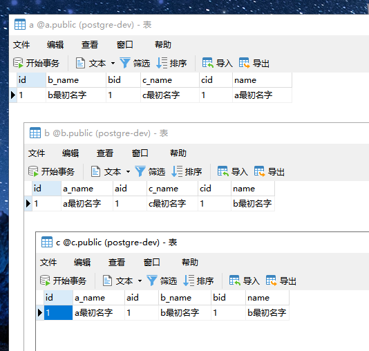
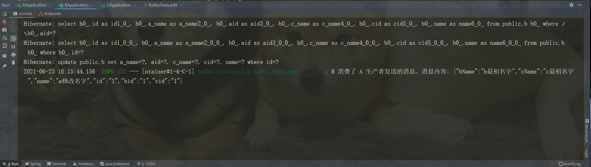
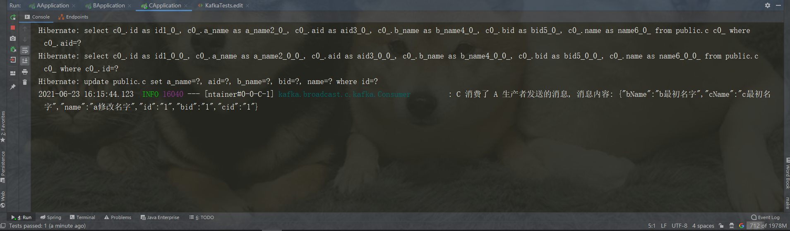
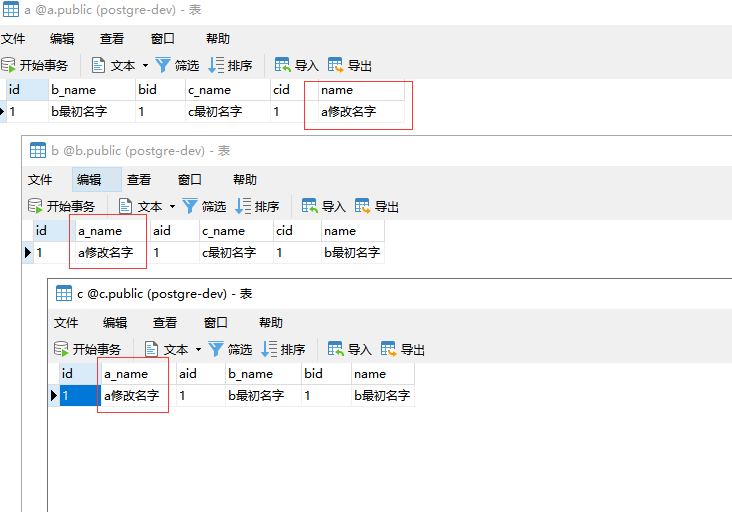

* [背景问题](#背景问题)
* [问题分析 &amp; 解决](#问题分析--解决)
* [kafka 广播 demo](#kafka-广播-demo)
   * [概述](#概述)
   * [demo 实现思路](#demo-实现思路)
   * [具体实现](#具体实现)
      * [依赖](#依赖)
      * [配置](#配置)
         * [kafka 和数据库配置](#kafka-和数据库配置)
         * [自定义的 kafka 配置](#自定义的-kafka-配置)
      * [实体对象](#实体对象)
      * [生产者](#生产者)
      * [消费者](#消费者)
      * [单元测试（模拟数据初始化和更新）](#单元测试模拟数据初始化和更新)
         * [初始化](#初始化)
         * [更新](#更新)
   * [demo 效果展示](#demo-效果展示)
* [demo 源码](#demo-源码)


# 背景问题
在分布式微服务架构中，A 服务某对象可能会冗余 B 服务某对象的字段，当 B 服务有更新操作时，需要同步更新 A 冗余字段的内容。
# 问题分析 & 解决
冗余字段更新通常有以下几个特点：
- 运行速度慢，冗余字段涉及多个服务
- 不需要极致的响应速度

根据以上分析得出结论，冗余字段的更新会影响当前业务的响应速度（与微服务数量成正比），冗余字段的更新不需要立刻同步。

使用消息中间件解决此场景问题比较合适，下文将以 kafka 广播的方式来解决不同微服务之间冗余字段更新的问题。

# kafka 广播 demo
## 概述
demo 项目一共分为三个模块 a、b、c 来模拟不同的微服务，每个微服务将 kafka 配置统一结构存储在项目配置文件中。当某一个服务的字段发生更新，向 kafka 发送更新内容消息，冗余了此服务字段的服务添加 topic 监听逻辑，完成冗余字段的更新。
## demo 实现思路
a、b、c 三个对象有两个自身属性 id 和 name，同时冗余另外两个对象的 id 和 name，当 a 的 name 更新时，向 kafka 发送更新后的对象信息，b、c kafka 消费者的处理逻辑，根据 a 的 id 更新自己冗余的 a 的 name
## 具体实现
下面将以 a 服务为例，描述具体实现
### 依赖
```
<!--kafka 相关-->
<dependency>
    <groupId>org.springframework.kafka</groupId>
    <artifactId>spring-kafka</artifactId>
</dependency>
<!--数据库相关-->
<dependency>
    <groupId>com.alibaba</groupId>
    <artifactId>druid-spring-boot-starter</artifactId>
    <version>1.1.22</version>
</dependency>
<dependency>
    <groupId>org.postgresql</groupId>
    <artifactId>postgresql</artifactId>
    <version>42.2.18</version>
</dependency>
<dependency>
    <groupId>org.springframework.boot</groupId>
    <artifactId>spring-boot-starter-data-jpa</artifactId>
</dependency>
```
其它项目依赖不再赘述，根据需求自行添加

### 配置
#### kafka 和数据库配置
```
spring:
  kafka:
    bootstrap-servers: 10.101.1.18:9091,10.101.1.18:9092,10.101.1.18:9093
    producer:
      # 发生错误后，消息重发的次数。
      retries: 0
      #当有多个消息需要被发送到同一个分区时，生产者会把它们放在同一个批次里。该参数指定了一个批次可以使用的内存大小，按照字节数计算。
      batch-size: 16384
      # 设置生产者内存缓冲区的大小。
      buffer-memory: 33554432
      # 键的序列化方式
      key-serializer: org.apache.kafka.common.serialization.StringSerializer
      # 值的序列化方式
      value-serializer: org.apache.kafka.common.serialization.StringSerializer
      # acks=0 ： 生产者在成功写入消息之前不会等待任何来自服务器的响应。
      # acks=1 ： 只要集群的首领节点收到消息，生产者就会收到一个来自服务器成功响应。
      # acks=all ：只有当所有参与复制的节点全部收到消息时，生产者才会收到一个来自服务器的成功响应。
      acks: 1
    consumer:
      # 自动提交的时间间隔 在spring boot 2.X 版本中这里采用的是值的类型为Duration 需要符合特定的格式，如1S,1M,2H,5D
      auto-commit-interval: 1S
      # 该属性指定了消费者在读取一个没有偏移量的分区或者偏移量无效的情况下该作何处理：
      # latest（默认值）在偏移量无效的情况下，消费者将从最新的记录开始读取数据（在消费者启动之后生成的记录）
      # earliest ：在偏移量无效的情况下，消费者将从起始位置读取分区的记录
      auto-offset-reset: earliest
      # 是否自动提交偏移量，默认值是true,为了避免出现重复数据和数据丢失，可以把它设置为false,然后手动提交偏移量
      enable-auto-commit: false
      # 键的反序列化方式
      key-deserializer: org.apache.kafka.common.serialization.StringDeserializer
      # 值的反序列化方式
      value-deserializer: org.apache.kafka.common.serialization.StringDeserializer
    listener:
      # 在侦听器容器中运行的线程数。
      concurrency: 5
      #listner负责ack，每调用一次，就立即commit
      ack-mode: manual_immediate
      missing-topics-fatal: false
  datasource:
    driverClassName: org.postgresql.Driver
    druid:
      filter:
        commons-log:
          statement-executable-sql-log-enable: true
          statement-log-enabled: true
        stat:
          enabled: true
          log-slow-sql: true
      stat-view-servlet:
        enabled: true
        login-password: 123456
        login-username: root
        reset-enable: true
        url-pattern: /druid/*
    initialization-mode: never
    logSlowSql: true
    password: changeme
    type: com.alibaba.druid.pool.DruidDataSource
    url: jdbc:postgresql://10.101.1.17:15432/a
    username: postgres
  jpa:
    generate-ddl: true
    hibernate:
      ddl-auto: update
    properties:
      hibernate:
        default_schema: public
    show-sql: true
```
#### 自定义的 kafka 配置
```
kakfa:
  # a 的 kafka group 
  group: a-group
  topic:
    producer:
      # 生产者 topic
      a: a-topic
    consumer:
      # 消费者 topic
      b: b-topic
      c: c-topic
```
### 实体对象
```
@Data
@Entity
@Table(name = "a")
public class A implements Serializable {
    private static final long serialVersionUID = 1L;

    @Id
    private String id;

    private String name;

    private String bid;

    private String bName;

    private String cid;

    private String cName;
}
```
### 生产者
```
public void send(Object o) {
    String s = JSONObject.toJSONString(o);
    log.info("准备发送消息, 消息内容: {}", s);
    ListenableFuture<SendResult<String, String>> listenableFuture = kafkaTemplate.send(this.topic, s);
    listenableFuture.addCallback(new ListenableFutureCallback<SendResult<String, String>>() {
        @Override
        public void onFailure(@NotNull Throwable throwable) {
            log.error("topic {} 生产者发送消息失败 {}", topic, throwable.getMessage());
        }

        @Override
        public void onSuccess(SendResult<String, String> stringStringSendResult) {
            log.info("topic {} 生产者发送消息成功 {}", topic, stringStringSendResult);
        }
    });
}
```
### 消费者
```
@KafkaListener(topics = "#{'${kakfa.topic.consumer.b}'}", groupId = "#{'${kakfa.group}'}")
private void bEdit(ConsumerRecord<String, String> consumerRecord, Acknowledgment acknowledgment) {
    JSONObject jsonObject = JSONObject.parseObject(consumerRecord.value());

    List<A> aList = aDAO.findAllByBid(jsonObject.get("id").toString());
    aList.forEach(a -> a.setBName(jsonObject.get("name").toString()));
    aDAO.saveAll(aList);

    log.info("A 消费了 B 生产者发送的消息, 消息内容: {}", jsonObject);
    acknowledgment.acknowledge();
}
```
### 单元测试（模拟数据初始化和更新）
#### 初始化
```
@Test
void initialize() {
    A a = new A();
    a.setId("1");
    a.setName("a最初名字");
    a.setBid("1");
    a.setBName("b最初名字");
    a.setCid("1");
    a.setCName("c最初名字");

    aDAO.save(a);
}
```
#### 更新
```
@Test
void edit() {
    Optional<A> aOptional = aDAO.findById("1");
    if (!aOptional.isPresent()) {
        log.warn("未查询到数据");
        return;
    }
    A a = aOptional.get();
    a.setName("a修改名字");
    aDAO.save(a);
    producer.send(a);
}
```
## demo 效果展示
说明：a 的 name 发生更新，b、c 中的冗余 a_name 同步更新
1. 启动三个服务
2. 运行三个服务的初始化单元测试，这是三个微服务数据库如下图


3. 运行 a 模拟更新的单元测试，a 生产者发送消息，b、c 消费者更新冗余字段，同时数据库信息发生变更







# demo 源码
地址：https://github.com/JCXTB/kafka-broadcast
